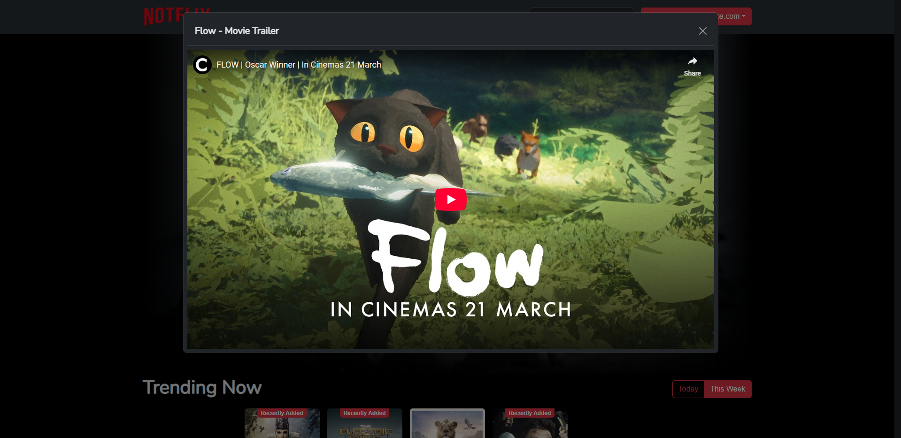

# Notflix

  

  
  
  
  
  

## About

Notflix is a movie browsing application built with Blazor and Entity Framework Core. This project was developed during a two-week college assignment by Juwan Jouma and Joulian Alsuliman.

**Disclaimer:** This project has no affiliation with Netflix and was created solely for educational purposes.

## Features

- Browse popular and trending movies
- Search for movies by title
- View detailed movie information
- User authentication system
- Favorite movies functionality
- Responsive design

## Technologies

- **Blazor**: Web framework for building interactive web UIs using C#
- **Bootstrap**: Front-end framework for responsive design
- **Entity Framework Core**: ORM for database operations
- **TMDb API**: The Movie Database API for fetching movie data
- **SQLite**: Lightweight database for storing user information
- **Blazored.LocalStorage/SessionStorage**: For client-side storage
- **EmailService**: For handling email communications including verification and password reset
- **BCrypt.Net**: For secure password hashing

## Getting Started

### Prerequisites

- .NET 6.0 SDK or later
- Visual Studio 2022 or Visual Studio Code

### Installation

1. Clone the repository
2. Open the solution in Visual Studio
3. Restore NuGet packages
4. Run the application

## See It In Action

  
   
  <em>Main Page - Browse trending movies</em>

  
   
  <em>Browse movies by genres</em>

  
   
  <em>Horror genre selection</em>

  
   
  <em>Search for movies by title</em>

  
   
  <em>Watch movie trailers</em>

  
   
  <em>User registration</em>

  
   
  <em>User settings</em>

## Project Structure

- **BlazorApp**: Main Blazor Server application
  - **DB**: Database context and models
  - **Models**: Data transfer objects
  - **Pages**: Razor pages for the application
  - **Services**: Business logic and API services
  - **Shared**: Reusable Razor components

- **NotflixApp**: Desktop wrapper application

## Contributors

  
  

